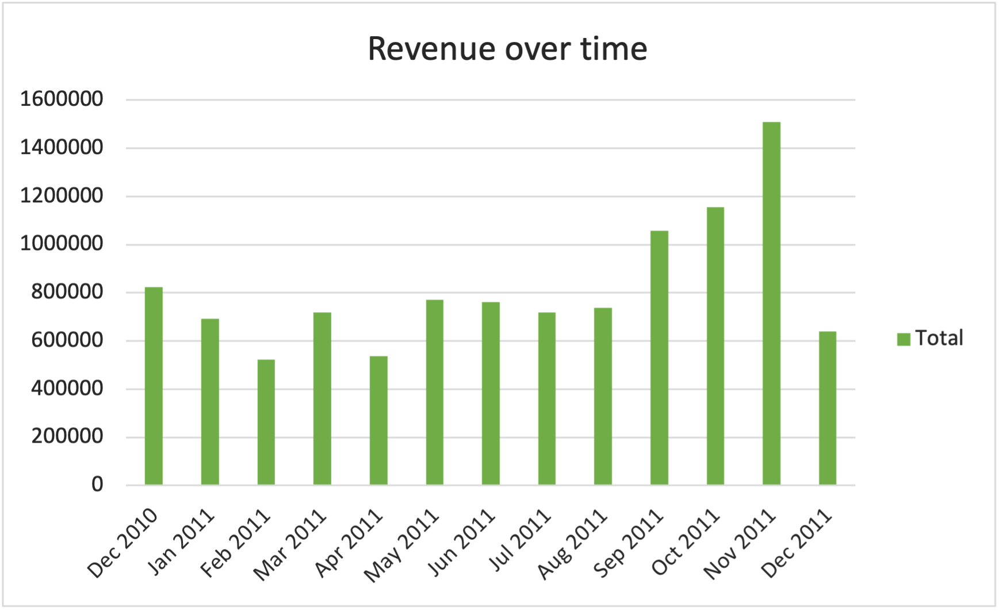
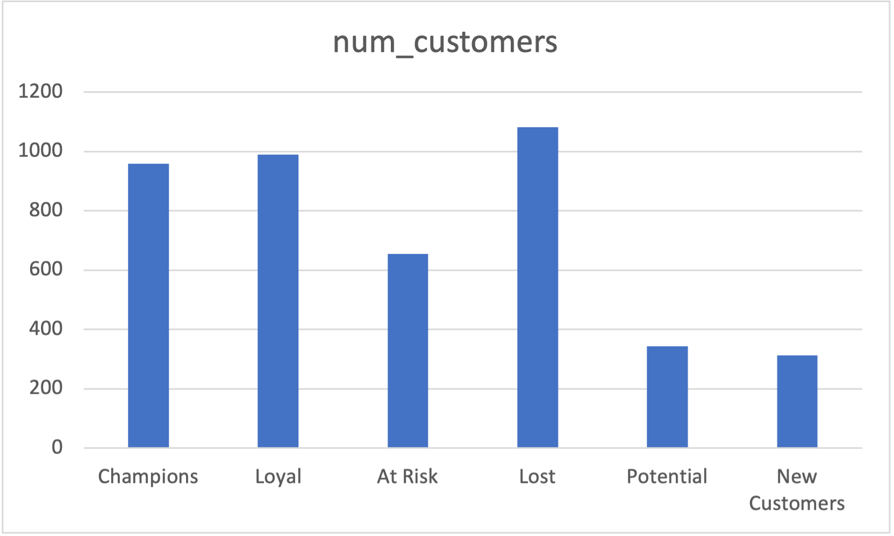
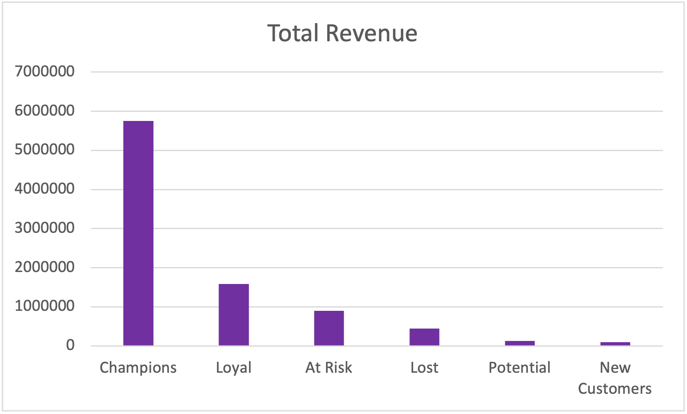

# E-commerce Data Analysis

## 📊 Overview
Analysis of 500K+ e-commerce transactions to evaluate revenue quality, customer behavior, and operational efficiency, with a focus on identifying revenue leakage and transaction anomalies.
---

## 🧠 Business Questions

### 1. What is the impact of negative transactions on revenue?
#### 🔹 SQL Query
```sql
SELECT
    COUNT(DISTINCT InvoiceNo) AS total_orders,
    COUNT(DISTINCT CASE WHEN InvoiceNo LIKE 'C%' THEN InvoiceNo END) AS cancelled_orders
FROM online_retail;
```
#### 📊 Result
Total Orders: 25,900

Cancelled Orders: 3,836

cancellation rate : ≈ 14.8%

### 💡 Insight

When calculated at the order level, the cancellation rate is approximately 15%, which is significantly higher than the initial row-level estimate (~1.7%).

This highlights the importance of using the correct level of aggregation in data analysis.

A 15% cancellation rate suggests a potential operational or customer experience issue that may require further investigation.
### 2.Completed Sales Revenue
#### 🔹 SQL Query
```sql
SELECT SUM(Quantity * UnitPrice) AS completed
FROM online_retail
WHERE InvoiceNo NOT LIKE 'C%'
AND Quantity > 0;
```
### 📊 Result
Completed Sales Revenue (no cancellations, no returns): 10,644,560.424
### 💡 Insight

This metric represents revenue generated only from successful transactions.

Both cancelled orders and negative quantities (returns) were excluded to focus on actual completed sales.

This is different from standard net revenue definitions, which may include returns depending on business context.
### 3. Revenue Breakdown

#### 🔹 SQL Query
```sql
SELECT 
    SUM(Quantity * UnitPrice) AS gross_revenue,
    SUM(CASE 
        WHEN Quantity < 0 THEN Quantity * UnitPrice 
        ELSE 0 
    END) AS negative_impact
FROM online_retail;
```
### 📊 Result
Gross Revenue: 9,747,747.934
Negative Impact: -896,812.49
### 💡 Insight

A significant portion of revenue (~900K) is lost due to negative transactions.

These transactions represent cancellations/returns and highlight a key source of revenue leakage.
This breakdown shows that approximately 9% of gross revenue is lost due to negative transactions, indicating a non-trivial revenue leakage.
### 4. How many unique customers are there?

#### 🔹 SQL Query
```sql
SELECT COUNT(DISTINCT CustomerID) FROM online_retail;
```
### 📊 Result
Unique Customers: 4,373
### 💡 Insight

Although the dataset contains over 500K transactions, only 4,373 unique customers exist.

This indicates a high level of repeat purchasing behavior, suggesting strong customer retention.
### 5. What are the top-selling products?

#### 🔹 SQL Query
```sql
SELECT Description, SUM(Quantity) AS total_sold
FROM online_retail
GROUP BY Description
ORDER BY total_sold DESC
LIMIT 10;
```
### 📊 Result

Top 5 products by quantity sold:

WORLD WAR 2 GLIDERS ASSTD DESIGNS → 53,847
JUMBO BAG RED RETROSPOT → 47,363
ASSORTED COLOUR BIRD ORNAMENT → 36,381
POPCORN HOLDER → 36,334
PACK OF 72 RETROSPOT CAKE CASES → 36,039
### 💡 Insight

Some products are sold in very high quantities.

This suggests that customers buy these items frequently, making them important for overall sales volume.

However, high quantity does not always mean high revenue, so further analysis is needed to check their actual financial impact.
### 6. How does revenue change over time?

#### 🔹 SQL Query
```sql
SELECT DATE_TRUNC('month', InvoiceDate::timestamp) AS month,
       SUM(Quantity * UnitPrice) AS revenue
FROM online_retail
WHERE Quantity > 0
GROUP BY month
ORDER BY month;
```
### 📊 Result

Revenue shows fluctuations across months, with noticeable peaks during certain periods.

### 💡 Insight

Revenue trends were analyzed based on completed transactions only (excluding negative quantities).

This provides a clearer view of actual sales performance without distortion from cancellations or returns.
### 7. How are customers segmented based on purchasing behavior? (RFM Analysis)

#### 🔹 SQL Query
```sql
WITH rfm AS (
    SELECT 
        CustomerID,
        DATE_PART('day', CURRENT_DATE - MAX(InvoiceDate::timestamp)) AS recency,
        COUNT(DISTINCT InvoiceNo) AS frequency,
        SUM(Quantity * UnitPrice) AS monetary
    FROM online_retail
    WHERE CustomerID IS NOT NULL
    AND CustomerID <> ''
    AND CustomerID <> 'NULL'
    AND Quantity > 0
    GROUP BY CustomerID
),
scored AS (
    SELECT *,
        NTILE(5) OVER (ORDER BY recency DESC) AS r_score,
        NTILE(5) OVER (ORDER BY frequency) AS f_score,
        NTILE(5) OVER (ORDER BY monetary) AS m_score
    FROM rfm
),
segmented AS (
    SELECT *,
        CASE 
            WHEN r_score >= 4 AND f_score >= 4 AND m_score >= 4 THEN 'Champions'
            WHEN r_score >= 3 AND f_score >= 3 THEN 'Loyal'
            WHEN r_score >= 4 AND f_score <= 2 THEN 'New Customers'
            WHEN r_score <= 2 AND f_score >= 3 THEN 'At Risk'
            WHEN r_score <= 2 AND f_score <= 2 THEN 'Lost'
            ELSE 'Potential'
        END AS segment
    FROM scored
)

SELECT segment, COUNT(*) AS num_customers
FROM segmented
GROUP BY segment
ORDER BY num_customers DESC;
```
#### 📊 Result
Lost: 1,081

Loyal: 990

Champions: 958

At Risk: 655

Potential: 343

New Customers: 312
#### 💡 Insight

Customer distribution shows a relatively balanced spread across segments, with a slightly higher concentration in the "Lost" category.

This indicates that a significant portion of customers are no longer actively engaged, suggesting potential issues in retention.

At the same time, a strong base of "Loyal" and "Champion" customers exists, representing high-value users who contribute consistently to the business.

The presence of "At Risk" customers highlights an opportunity for targeted retention strategies, while "New Customers" indicate ongoing customer acquisition.

Overall, the business demonstrates both growth potential and retention challenges, requiring a balanced focus on maintaining high-value customers and re-engaging inactive ones.

Although "Champions" are not the largest group, they likely generate a significant portion of total revenue, making them highly valuable to the business.
### 8.Revenue per Segment

#### 🔹 SQL Query
```sql
WITH rfm AS (
    SELECT 
        CustomerID,
        DATE_PART('day', CURRENT_DATE - MAX(InvoiceDate::timestamp)) AS recency,
        COUNT(DISTINCT InvoiceNo) AS frequency,
        SUM(Quantity * UnitPrice) AS monetary
    FROM online_retail
    WHERE CustomerID IS NOT NULL
    AND CustomerID <> ''
    AND CustomerID <> 'NULL'
    AND Quantity > 0
    GROUP BY CustomerID
),
scored AS (
    SELECT *,
        NTILE(5) OVER (ORDER BY recency DESC) AS r_score,
        NTILE(5) OVER (ORDER BY frequency) AS f_score,
        NTILE(5) OVER (ORDER BY monetary) AS m_score
    FROM rfm
),
segmented AS (
    SELECT *,
        CASE 
            WHEN r_score >= 4 AND f_score >= 4 AND m_score >= 4 THEN 'Champions'
            WHEN r_score >= 3 AND f_score >= 3 THEN 'Loyal'
            WHEN r_score >= 4 AND f_score <= 2 THEN 'New Customers'
            WHEN r_score <= 2 AND f_score >= 3 THEN 'At Risk'
            WHEN r_score <= 2 AND f_score <= 2 THEN 'Lost'
            ELSE 'Potential'
        END AS segment
    FROM scored
)
SELECT 
    segment,
    COUNT(*) AS num_customers,
    ROUND(SUM(monetary), 2) AS total_revenue,
    ROUND(AVG(monetary), 2) AS avg_customer_value
FROM segmented
GROUP BY segment
ORDER BY total_revenue DESC;
```

#### 📊 Result

- Champions: 958 customers | Total Revenue: 5,756,905.55 | Avg Value: 6,009
  
- Loyal: 990 customers | Total Revenue: 1,581,594.54 | Avg Value: 1,597  

- At Risk: 655 customers | Total Revenue: 897,134.10 | Avg Value: 1,369  

- Lost: 1,081 customers | Total Revenue: 450,145.35 | Avg Value: 416  

- Potential: 343 customers | Total Revenue: 130,189.35 | Avg Value: 379  

- New Customers: 312 customers | Total Revenue: 95,439.01 | Avg Value: 305

#### 💡 Insight

"Champions" represent a relatively small group of customers but generate the majority of total revenue, with the highest average customer value by a 

significant margin. This indicates a strong dependency on high-value customers.

Although "Lost" customers form the largest segment, their contribution to revenue is minimal, suggesting they have low business impact.

"At Risk" customers have relatively high average value, making them a critical segment. Losing these customers could significantly affect revenue.

Overall, the business relies heavily on a small group of high-value customers, while a large portion of customers contribute relatively little revenue.

This suggests that retention strategies should focus on high-value and at-risk customers rather than low-value segments.

## 📌 Business Recommendations

Based on the RFM segmentation analysis, the following strategic actions are recommended:

### 1. Retain High-Value Customers (Champions)

Champions generate the majority of revenue and have the highest average customer value.

👉 Actions:
- Offer loyalty programs or exclusive rewards
- Provide early access to new products
- Personalize communication and offers

📌 Expected Impact:
Increase customer lifetime value and maintain stable revenue from top customers.

---

### 2. Prevent Churn from At-Risk Customers

At Risk customers still have high value but show declining engagement.

👉 Actions:
- Send targeted re-engagement campaigns
- Offer limited-time discounts or incentives
- Identify drop-off patterns (e.g., time since last purchase)

📌 Expected Impact:
Reduce revenue loss by reactivating valuable but inactive customers.

---

### 3. Grow Loyal Customers into Champions

Loyal customers are consistent but not yet top spenders.

👉 Actions:
- Upsell and cross-sell relevant products
- Encourage higher purchase frequency
- Offer bundle deals

📌 Expected Impact:
Convert mid-value customers into high-value segments.

---

### 4. Optimize Acquisition of New Customers

New customers have low current value but represent future potential.

👉 Actions:
- Improve onboarding experience
- Offer first-purchase incentives
- Guide customers toward repeat purchases

📌 Expected Impact:
Increase retention and accelerate customer value growth.

---

### 5. Deprioritize Low-Value Segments (Lost & Potential)

These customers contribute minimally to revenue.

👉 Actions:
- Avoid excessive marketing spend on reactivation
- Use low-cost campaigns if needed (e.g., email)

📌 Expected Impact:
Optimize marketing budget allocation toward high-impact segments.

## 📂 SQL Queries
👉 [View SQL file](analysis.sql)
## 📊 Visualizations

### Revenue Over Time


### Customer Distribution by Segment


### Revenue by Customer Segment


## 📂 Project Structure

- `README.md` → Project overview, business questions, and insights  
- `analysis.sql` → Full SQL queries used in the analysis  
- `data/` → Dataset reference  
-`images/`→ Charts
